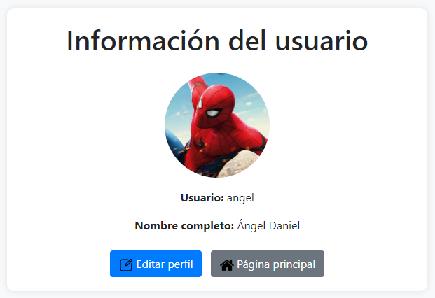

# control-usuarios

Aplicación que permite a los usuarios iniciar sesión ingresando su nombre de usuario y contraseña y modificar perfil. Realizada con PHP y estilors Bootstrap.
 
## Contenidos
 
1. [Capturas de pantalla](#capturas-de-pantalla)
2. [Tecnologías utilizadas](#tecnologías-utilizadas)
3. [Créditos](#créditos)
 
## Capturas de pantalla
Inicio de la Aplicaciíon.

Formulario de inicio de sesión.

Credenciales introducidos erroneos.

Sesión iniciada.

Información del usuario.

Edición del usuario.

Usuario editado.

 
 
## Tecnologías utilizadas
 
- JavaScript
- HTLM
- CSS
- Bootstrap

 
## Créditos
 
Este proyecto fue desarrollado por [Ángel Daniel](https://github.com/AngelDanielRuizMontes/).
